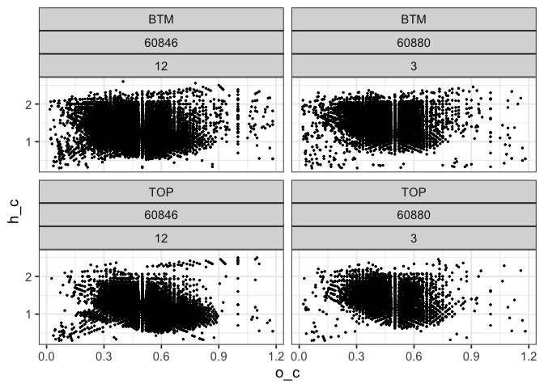
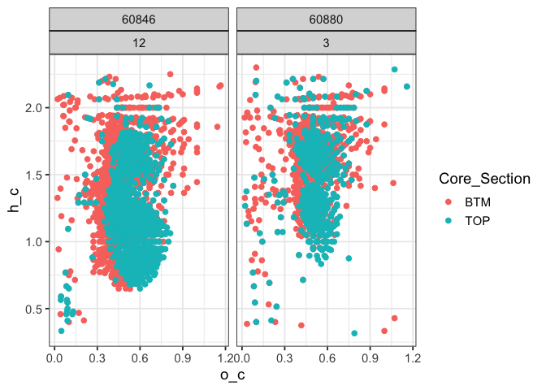

## R Markdown

#### Import and combine data


```r
## Each sample has 3 replicates, compressed in a single zip file.
## This script will extract all the zip files in the target folder (creating temporary files) and import and combine them into a single dataframe.
## Finally, we will delete the temporary files.

import_files = function(FILEPATH){

  # identify the .zip files and unzip them as csv files
  # the csv files will be saved in the parent directory (these are temporary files, will be deleted at the end)
  zip_filePaths <- list.files(path = FILEPATH, pattern = ".zip", full.names = TRUE, recursive = TRUE)
  zip_filePaths %>% lapply(unzip)
  
  # now, identify all the fticrWEOM csv files that we just extracted 
  csv_filePaths <- list.files(pattern = "fticrWEOM", full.names = TRUE)
  
  # read and combine the fticrWEOM csv files
  icr_dat <- do.call(bind_rows, lapply(csv_filePaths, function(path) {
    
    data = read.csv(path) %>% 
      mutate(source = basename(path)) # add file name
    
  }))
  
  # finally, delete the temporary files from the parent directory
  file.remove(csv_filePaths)

  # this is our final output
  icr_dat
}

icr_data = import_files("FTICR-MS/FTICR_Processing_data")
```

#### Initial cleaning


```r
icr_columns =
  icr_data %>% 
  janitor::clean_names() %>% 
  dplyr::select(source, molecular_formula, calculated_m_z, h_c, o_c, dbe, c, h, o, n, p, s, contains("peak_area")) %>% 
  separate(source, sep = "_", into = c("icr", "Proposal_ID", "Sampling_Set", "Core_Section", "Rep")) %>% 
  mutate(Rep = parse_number(Rep)) %>% 
  dplyr::select(-icr)


head(icr_columns) %>% knitr::kable()
```


|Proposal_ID |Sampling_Set |Core_Section | Rep|molecular_formula | calculated_m_z|       h_c|       o_c| dbe|  c|  h|  o|  n|  p|  s| peak_area_1| peak_area_2| peak_area_3|
|:-----------|:------------|:------------|---:|:-----------------|--------------:|---------:|---------:|---:|--:|--:|--:|--:|--:|--:|-----------:|-----------:|-----------:|
|60846       |12           |BTM          |   1|C4 H6 O4          |       117.0193| 1.5000000| 1.0000000|   2|  4|  6|  4| NA| NA| NA|    165.4613|          NA|          NA|
|60846       |12           |BTM          |   1|C7 H6 O2          |       121.0295| 0.8571429| 0.2857143|   5|  7|  6|  2| NA| NA| NA|    714.4242|   1058.4286|    717.0051|
|60846       |12           |BTM          |   1|C6 H6 O3          |       125.0244| 1.0000000| 0.5000000|   4|  6|  6|  3| NA| NA| NA|    173.8752|    346.4921|    262.1961|
|60846       |12           |BTM          |   1|C6 H8 O3          |       127.0401| 1.3333333| 0.5000000|   3|  6|  8|  3| NA| NA| NA|    370.3141|    440.2943|    324.5887|
|60846       |12           |BTM          |   1|C7 H12 O2         |       127.0765| 1.7142857| 0.2857143|   2|  7| 12|  2| NA| NA| NA|    207.7001|    241.4806|    220.2612|
|60846       |12           |BTM          |   1|C5 H7 O3 N1       |       128.0353| 1.4000000| 0.6000000|   3|  5|  7|  3|  1| NA| NA|    759.1546|    795.0198|    658.9399|

#### 3 acquisitions


```r
## acquisition reps

icr_acq = 
  icr_columns %>% 
  mutate(peak_area_1 = case_when(peak_area_1 > 0 ~ 1),
         peak_area_2 = case_when(peak_area_2 > 0 ~ 1),
         peak_area_3 = case_when(peak_area_3 > 0 ~ 1),
         acquisition_count = peak_area_1 + peak_area_2 + peak_area_3,
         acquisition_KEEP = acquisition_count >= 2) %>% 
  filter(acquisition_KEEP) %>% 
  dplyr::select(-c(contains("peak_area"), contains("acquisition")))
```


#### 3 replicates


```r
## Now, we only select molecules that were identified in 2/3 of the total reps

max_replicates = 
  icr_acq %>% 
  dplyr::select(Proposal_ID, Sampling_Set, Core_Section, Rep) %>% 
  distinct() %>% 
  group_by(Proposal_ID, Sampling_Set, Core_Section) %>% 
  dplyr::summarise(total_reps = n()) 


icr_reps = 
  icr_acq %>% 
  left_join(max_replicates) %>% 
  group_by(Proposal_ID, Sampling_Set, Core_Section, molecular_formula) %>% 
  dplyr::mutate(peak_reps = n()) %>%
  mutate(KEEP = peak_reps >= (2/3) * total_reps) %>% 
  filter(KEEP)

icr_reps_keep = 
  icr_reps %>% 
  dplyr::select(-c(Rep, total_reps, peak_reps, KEEP)) %>% 
  distinct()
```

---- 

# van krevelen


```r
icr_reps_keep %>% 
  ggplot(aes(x = o_c, y = h_c))+
  geom_point(size = 0.5)+
  facet_wrap(~ Core_Section + Proposal_ID + Sampling_Set)
```

<!-- -->

## unique peaks


```r
unique = 
  icr_reps_keep %>% 
  group_by(molecular_formula) %>% 
  dplyr::mutate(count = n())

unique %>% 
  filter(n == 1) %>% 
  ggplot(aes(x = o_c, y = h_c, color = Core_Section))+
  geom_point(size = 2)+
  facet_wrap(~ Proposal_ID + Sampling_Set)  
```

<!-- -->

