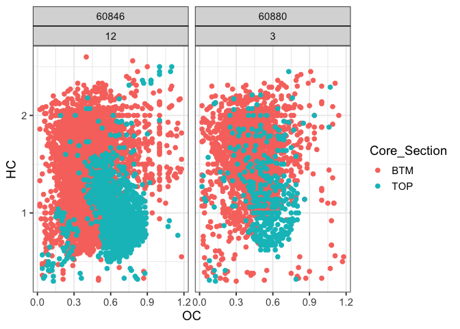
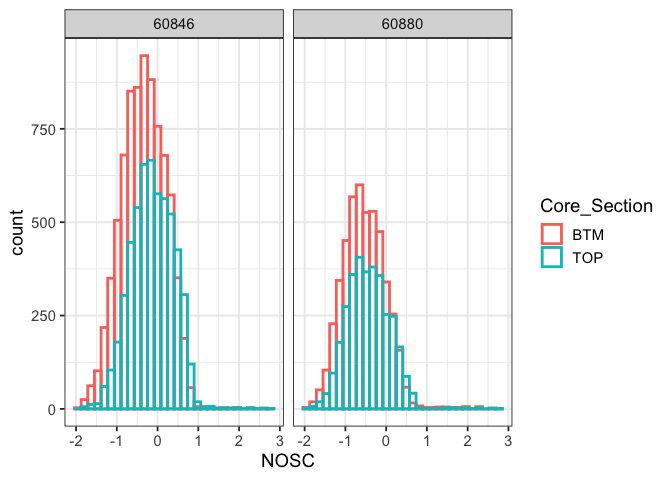
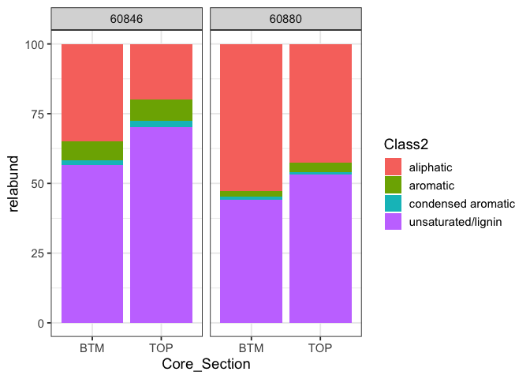
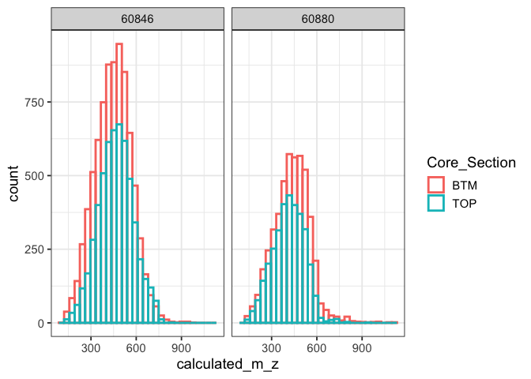

This tutorial is intended to allow participants to become familiar with FT-ICR-MS data, including importing and processing, and basic exploratory visualization. 

This RMarkdown document contains code and scripts for preliminary processing and data visualization of soil biogeochemistry data. 
These graphs were created for use in Session 3 (Biogeochemistry Data Tutorial) on Tuesday, November 7.


> **USING THIS TUTORIAL**  
Download the [FTICR_Processing_data](https://github.com/EMSL-MONet/CommSciMtg_Nov25/tree/main/FTICR-MS/FTICR_Processing_data) folder.  
Create a new R Script file and save it in the **same** folder as the data files. 
Make sure all these files are saved in the same folder, to minimize errors with file paths.


> This file is a Markdown report, which includes text as well as code chunks. You can copy the R code directly from these chunks and paste it into your R Script file. 


---

## Setup

## Load packages

You will need the `{tidyverse}` set of packages to run this tutorial. 
The `tidyverse` includes packages like `{dplyr}` and `{tidyr}` for data wrangling, and `{ggplot2}` for data visualization.


## Import and combine data

For this tutorial, we will work with the following 2 cores:

1. 60846_12
2. 60880_3

Each core was split into "TOP" and "BTM" depths, so we have a total of 4 samples for this tutorial.


Each sample was analyzed in triplicate -- all three analytical replicates are in a single zip file per sample.  
We will import all the files and combine them into a single dataframe.


```r
## This script will extract all the zip files in the target folder (creating temporary files) and import and combine them into a single dataframe.
## Finally, we will delete the temporary files.

import_files = function(FILEPATH){

  # identify the .zip files and unzip them as csv files
  # the csv files will be saved in the parent directory (these are temporary files, will be deleted at the end)
  zip_filePaths <- list.files(path = FILEPATH, pattern = ".zip", full.names = TRUE, recursive = TRUE)
  zip_filePaths %>% lapply(unzip)
  
  # now, identify all the fticrWEOM csv files that we just extracted 
  csv_filePaths <- list.files(pattern = "fticrWEOM", full.names = TRUE)
  
  # read and combine the fticrWEOM csv files
  icr_dat <- do.call(bind_rows, lapply(csv_filePaths, function(path) {
    
    data = read.csv(path) %>% 
      mutate(source = basename(path)) # add file name
    
  }))
  
  # finally, delete the temporary files from the parent directory
  file.remove(csv_filePaths)

  # this is our final output
  icr_dat
}

icr_report = import_files("FTICR-MS/FTICR_Processing_data")
```


This contains a lot of info -- we do not need all these columns! In the steps below, we will select only the necessary columns.


```r
names(icr_report)
```

```
##  [1] "Index"                     "Molecular.Formula"        
##  [3] "m.z.1"                     "m.z.2"                    
##  [5] "m.z.3"                     "Calibrated.m.z.1"         
##  [7] "Calibrated.m.z.2"          "Calibrated.m.z.3"         
##  [9] "m.z.Error.Score.1"         "m.z.Error.Score.2"        
## [11] "m.z.Error.Score.3"         "m.z.Error..ppm..1"        
## [13] "m.z.Error..ppm..2"         "m.z.Error..ppm..3"        
## [15] "Isotopologue.Similarity.1" "Isotopologue.Similarity.2"
## [17] "Isotopologue.Similarity.3" "Resolving.Power.1"        
## [19] "Resolving.Power.1.1"       "Resolving.Power.1.2"      
## [21] "Confidence.Score.1"        "Confidence.Score.2"       
## [23] "Confidence.Score.3"        "S.N.1"                    
## [25] "S.N.2"                     "S.N.3"                    
## [27] "Peak.Height.1"             "Peak.Height.2"            
## [29] "Peak.Height.3"             "Peak.Area.1"              
## [31] "Peak.Area.2"               "Peak.Area.3"              
## [33] "Calculated.m.z"            "H.C"                      
## [35] "O.C"                       "DBE"                      
## [37] "Ion.Charge"                "C"                        
## [39] "H"                         "O"                        
## [41] "N"                         "P"                        
## [43] "S"                         "X13C"                     
## [45] "X18O"                      "X33S"                     
## [47] "X34S"                      "Is.Isotopologue"          
## [49] "source"
```


Step 1 is to split this file into two: (a) `mol` file, which has info for each molecule/peak; and (b) `dat` file, which has data about the samples


#### Create molecular metadata file

This dataframe contains information pertaining to each peak, including the molecular formula and other molecular indices.  
We first select only the columns with atomic composition.


```r
mol = 
  icr_report %>% 
  dplyr::select(`Molecular.Formula`, C,H,O,N,P,S) %>% 
  rename(molecular_formula = `Molecular.Formula`) %>% 
  distinct()
```

Now, we want to process the `mol` file and calculate various indices

(a) indices

- AImod (aromatic index), for the identification of aromatic and condensed aromatic structures. This calculated based on [Koch and Dittmar (2016)](https://doi.org/10.1002/rcm.7433)
- NOSC (nominal oxidation state of carbon), which can give insight into potential thermodynamics. This is calculated based on [Riedel et al. 2012](https://doi.org/10.1021/es203901u)
- GFE (Gibbs Free Energy of carbon oxidation), calculated from NOSC, as per [LaRowe & Van Cappellen 2011](https://doi.org/10.1016/j.gca.2011.01.020)
- H/C, or the ratio of hydrogen to carbon in the molecule
- O/C, or the ratio of oxygen to carbon in the molecule


```r
mol = 
  mol %>% 
  mutate(across(c("N","S","P"), ~replace_na(.,0)),
         AImod = round((1 + C - (0.5*O) - S - (0.5 * (N+P+H)))/(C - (0.5*O) - S - N - P), 4),
         AImod = ifelse(is.na(AImod), 0, AImod),
         AImod = ifelse(AImod == "Inf", 0, AImod),
         AImod = ifelse(AImod == "-Inf", 0, AImod),
         NOSC =  round(4-(((4*C) + H - (3*N) - (2*O) - (2*S))/C), 4),
         GFE = 60.3-(28.5 * NOSC),
         HC = round(H/C, 2),
         OC = round(O/C, 2)
  )
```

(b) Elemental class

We can also group the molecules based on the elemental composition, i.e. "CHO", "CHONS", "CHONP", "CHONPS" classes


```r
mol = 
  mol %>% 
  mutate(
    El = str_remove_all(molecular_formula, "13C"),
    El = str_remove_all(El, "34S"),
    El = str_remove_all(El, "17O"),
    El = str_remove_all(El, "18O"),
    El = str_remove_all(El, "15N"),
    El = str_remove_all(El, "[0-9]"),
    El = str_remove_all(El, " "))
```

(c) molecular class

Next, we assign classes (aromatic, aliphatic, etc.). These are Van Krevelen classes, typically assigned based on the H/C, O/C, and AImod indices.   
We calculate three sets of classes; users can use any of these, or assign their own classes as appropriate.

1. `Class1` from [Kim et al. 2003](https://doi.org/10.1021/ac034415p) uses H/C and O/C to classify molecules into "lipid", "unsaturated hydrocarbon", "protein", "lignin", "carbohydrate", amino sugar", "tannin", and "condensed hydrocarbon"
2. `Class2` from [Seidel et al. 2014](10.1016/j.gca.2014.05.038) uses H/C, O/C, and AImod to classify molecules into "aromatic", "condensed aromatic", "highly unsaturated compounds including polyphenols/lignins", and "aliphatic"
3. `Class3` from [Seidel et al. 2017](10.1016/j.gca.2014.05.038) includes classes "aromatic", "condensed aromatic", "highly unsaturated compounds including polyphenols/lignins", "carbohydrate", "lipid", "aliphatic", and "aliphatic containing N".


```r
mol = 
  mol %>% 
  mutate(
    Class1 = case_when(HC >= 1.55 & HC <= 2.25 & OC >= 0 & OC <= 0.3 ~ "Lipid",
                       HC >= 0.7 & HC <= 1.5 & OC >= 0.05 & OC <= 0.15 ~ "Unsat Hydrocarbon",
                       HC >= 1.45 & HC <= 2 & OC >= 0.3 & OC <= 0.55 ~ "Protein",
                       HC >= 0.81 & HC <= 1.45 & OC >= 0.28 & OC <= 0.65 ~ "Lignin",
                       HC >= 1.48 & HC <= 2.15 & OC >= 0.68 & OC <= 1 ~ "Carbohydrate",
                       HC >= 1.34 & HC <= 1.8 & OC >= 0.54 & OC <= 0.71 ~ "Amino Sugar",
                       HC >= 0.7 & HC <= 1.3 & OC >= 0.65 & OC <= 1.05 ~ "Tannin",
                       HC >= 0.3 & HC <= 0.81 & OC >= 0.12 & OC <= 0.7 ~ "Cond Hydrocarbon",
                       TRUE ~ "Other"),
    Class2 = case_when(AImod > 0.66 ~ "condensed aromatic",
                       AImod <= 0.66 & AImod > 0.50 ~ "aromatic",
                       AImod <= 0.50 & HC < 1.5 ~ "unsaturated/lignin",
                       HC >= 1.5 ~ "aliphatic"),
    Class2 = replace_na(Class2, "other"),
    Class3 = case_when(AImod > 0.66 ~ "condensed aromatic",
                       AImod <= 0.66 & AImod > 0.50 ~ "aromatic",
                       AImod <= 0.50 & HC < 1.5 ~ "unsaturated/lignin",
                       HC >= 2.0 & OC >= 0.9 ~ "carbohydrate",
                       HC >= 2.0 & OC < 0.9 ~ "lipid",
                       HC < 2.0 & HC >= 1.5 & N == 0 ~ "aliphatic",
                       HC < 2.0 & HC >= 1.5 & N > 0 ~ "aliphatic+N")
  )
```


this file now contains most of the info needed to interpret the data across different samples.


```r
names(mol)
```

```
##  [1] "molecular_formula" "C"                 "H"                
##  [4] "O"                 "N"                 "P"                
##  [7] "S"                 "AImod"             "NOSC"             
## [10] "GFE"               "HC"                "OC"               
## [13] "El"                "Class1"            "Class2"           
## [16] "Class3"
```

---

#### Create `dat` file


```r
dat = 
  icr_report %>% 
  dplyr::select(source, Molecular.Formula, Calculated.m.z, contains("Peak.Area")) %>% 
  janitor::clean_names() %>% 
  separate(source, sep = "_", into = c("icr", "Proposal_ID", "Sampling_Set", "Core_Section", "Rep")) %>% 
  mutate(Rep = parse_number(Rep),
         sample_name = paste0(Proposal_ID, "_", Sampling_Set, "_", Core_Section)) %>% 
  dplyr::select(-icr)
```


#### 3 acquisitions


```r
## acquisition reps

dat_acq = 
  dat %>% 
  mutate(peak_area_1 = case_when(peak_area_1 > 0 ~ 1),
         peak_area_2 = case_when(peak_area_2 > 0 ~ 1),
         peak_area_3 = case_when(peak_area_3 > 0 ~ 1),
         acquisition_count = peak_area_1 + peak_area_2 + peak_area_3,
         acquisition_KEEP = acquisition_count >= 2) %>% 
  filter(acquisition_KEEP) %>% 
  dplyr::select(-c(contains("peak_area"), contains("acquisition")))
```


#### 3 replicates


```r
## Now, we only select molecules that were identified in 2/3 of the total reps

max_replicates = 
  dat_acq %>% 
  dplyr::select(sample_name, Proposal_ID, Sampling_Set, Core_Section, Rep) %>% 
  distinct() %>% 
  group_by(sample_name, Proposal_ID, Sampling_Set, Core_Section) %>% 
  dplyr::summarise(total_reps = n()) 


dat_reps = 
  dat_acq %>% 
  left_join(max_replicates) %>% 
  group_by(Proposal_ID, Sampling_Set, Core_Section, molecular_formula) %>% 
  dplyr::mutate(peak_reps = n()) %>%
  ungroup() %>% 
  mutate(KEEP = peak_reps >= (2/3) * total_reps) %>% 
  filter(KEEP) %>% 
  dplyr::select(-KEEP)

dat_reps_keep = 
  dat_reps %>% 
  dplyr::select(-c(Rep, total_reps, peak_reps)) %>% 
  distinct()
```

This is the list of all the peaks "present" (identified) in our samples.

Now, combine this file with the `mol` file we generated above.


```r
icr_processed = 
  dat_reps_keep %>% 
  left_join(mol)

names(icr_processed)
```

```
##  [1] "Proposal_ID"       "Sampling_Set"      "Core_Section"     
##  [4] "molecular_formula" "calculated_m_z"    "sample_name"      
##  [7] "C"                 "H"                 "O"                
## [10] "N"                 "P"                 "S"                
## [13] "AImod"             "NOSC"              "GFE"              
## [16] "HC"                "OC"                "El"               
## [19] "Class1"            "Class2"            "Class3"
```

---- 

# Van Krevelen Plots and Molecular Classes


## VK Domains


```r
vk_domains = 
  icr_processed %>% 
  dplyr::select(HC, OC, Class1, Class2, Class3)

vk1 = 
  vk_domains %>% 
  ggplot(aes(x = OC, y = HC, color = Class1))+
  geom_point()

vk2 = 
  vk_domains %>% 
  ggplot(aes(x = OC, y = HC, color = Class2))+
  geom_point()

vk3 = 
  vk_domains %>% 
  ggplot(aes(x = OC, y = HC, color = Class3))+
  geom_point()

cowplot::plot_grid(vk1, vk2, vk3)
```

<!-- -->


## VK Patterns in samples


```r
icr_processed %>% 
  ggplot(aes(x = OC, y = HC))+
  geom_point(size = 0.5)+
  facet_wrap(~ sample_name)
```

<!-- -->

## unique peaks

top vs. bottom


```r
unique_top = 
  icr_processed %>% 
  group_by(molecular_formula, Proposal_ID) %>% 
  dplyr::mutate(count = n()) %>% 
  ungroup()

unique_top %>% 
  filter(count == 1) %>% 
  ggplot(aes(x = OC, y = HC, color = Core_Section))+
  geom_point(size = 2)+
  facet_wrap(~ Proposal_ID + Sampling_Set)  
```

<!-- -->


comparing sites


```r
unique_site = 
  icr_processed %>% 
  filter(Core_Section == "TOP") %>% 
  group_by(molecular_formula) %>% 
  dplyr::mutate(count = n())

unique_site %>% 
  filter(count == 1) %>% 
  ggplot(aes(x = OC, y = HC, color = Proposal_ID))+
  geom_point(size = 2)+
  stat_ellipse(level = 0.90, linewidth = 1, aes(group = Proposal_ID), color = "black")
```

<!-- -->


```r
icr_processed %>% 
  ggplot(aes(x = NOSC, color = Core_Section))+
  geom_histogram(position = "identity", fill = NA, linewidth = 1)+
  facet_wrap(~Proposal_ID)
```

<!-- -->

```r
icr_processed %>% 
  ggplot(aes(x = calculated_m_z, color = Core_Section))+
  geom_histogram(position = "identity", fill = NA, linewidth = 1)+
#  geom_density(linewidth = 1)+
  facet_wrap(~Proposal_ID)
```

<!-- -->


### relative abundance


```r
relabund = 
  icr_processed %>% 
  group_by(Proposal_ID, Sampling_Set, Core_Section, sample_name, Class2) %>% 
  dplyr::summarise(count = n()) %>% 
  group_by(Proposal_ID, Sampling_Set, Core_Section, sample_name) %>% 
  dplyr::mutate(total = sum(count),
                relabund = 100 * count/total) %>% 
  ungroup()

relabund %>% 
  ggplot(aes(x = Core_Section, y = relabund, fill = Class2)) +
  geom_bar(stat = "identity")+
  facet_wrap(~Proposal_ID)
```

<!-- -->

